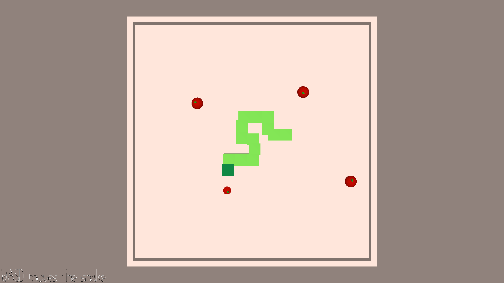

# SnakeBop

**Author:** Angela Zhang

**Design:** SnakeBop is a rhythm-based variation of the classic game snake. Apples will spawn/despawn according to the BGM, and you must eat to avoid starving to death!

**Screen Shot:**

**How To Play:**

Use WASD to move the snake. Most of the same rules apply from the classic snake game - don't run into the walls, don't run into yourself - but movement is no longer discrete (grid-based) and there is now a hunger bar. 

Apples will spawn randomly across the map according following a beat of the song, and the snake must eat to avoid starvation. The screen will progressively get more red as the snake's hunger bar fills up.

Eating an apple will reduce the hunger bar, but will also increase the snake's speed and hunger growth rate. Stay alive for as long as possible!

**References:**
Looked at a coding tutorial for Snake to get some reference on how the game is structured.
https://dev.to/lukegarrigan/how-to-code-snake-1jeb

Music created using GarageBand.

This game was built with [NEST](NEST.md).
